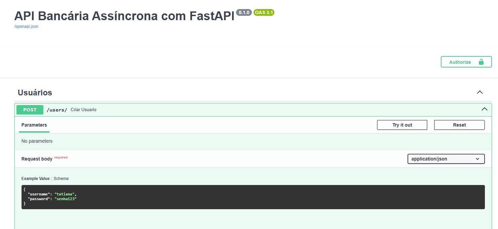

# API Bancária Assíncrona com FastAPI

  


---

## Sobre o Projeto

Esta é uma API RESTful assíncrona construída com FastAPI para gerenciar operações bancárias, incluindo depósitos, saques e consulta de extratos. O projeto utiliza autenticação JWT para garantir a segurança no acesso aos endpoints protegidos.

Este projeto faz parte do Bootcamp Formação Python Backend Developer da DIO.





---

## Funcionalidades

- Cadastro de contas bancárias
- Registro de transações (depósitos e saques)
- Consulta de extratos bancários detalhados
- Autenticação e autorização com JWT
- Validação de operações (ex: saldo insuficiente para saque)
- Documentação automática com OpenAPI (Swagger UI)

---

## Tecnologias Utilizadas

- Python 3.13
- FastAPI
- Uvicorn (Servidor ASGI)
- Pydantic (Validação de dados)
- SQLAlchemy (ORM para banco de dados)
- JWT (JSON Web Tokens)
- SQLite (banco de dados local para testes)

---

## Instalação e Execução

### Pré-requisitos

- Python 3.13 instalado
- Git instalado

### Passos para rodar localmente

1. Clone este repositório:

```bash
git clone https://github.com/TatianaKami/api-bancaria-fastapi.git


Acesse a pasta do projeto:

bash
Copiar
Editar
cd api-bancaria-fastapi
Crie e ative o ambiente virtual:

Windows (PowerShell):

bash
Copiar
Editar
python -m venv venv
.\venv\Scripts\Activate.ps1
Linux/Mac:

bash
Copiar
Editar
python3 -m venv venv
source venv/bin/activate
Instale as dependências:

bash
Copiar
Editar
pip install -r requirements.txt
Execute o servidor:

bash
Copiar
Editar
uvicorn app.main:app --reload
Abra no navegador a documentação interativa:

http://127.0.0.1:8000/docs

Estrutura do Projeto
pgsql
Copiar
Editar
api-bancaria-fastapi/
│
├── app/
│   ├── __init__.py
│   ├── main.py
│   ├── auth.py
│   ├── database.py
│   ├── models.py
│   └── schemas.py
│
├── venv/
│
├── requirements.txt
└── README.md
Como testar
Após rodar o servidor, use o Swagger UI para:

Criar usuários

Fazer login e obter token JWT

Registrar depósitos e saques

Consultar extratos

Lembre-se de autorizar o token no Swagger antes de acessar endpoints protegidos.

Contato
Tatiana Kami
LinkedIn

Bootcamp Formação Python Backend Developer - DIO